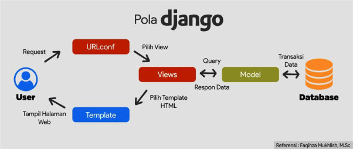
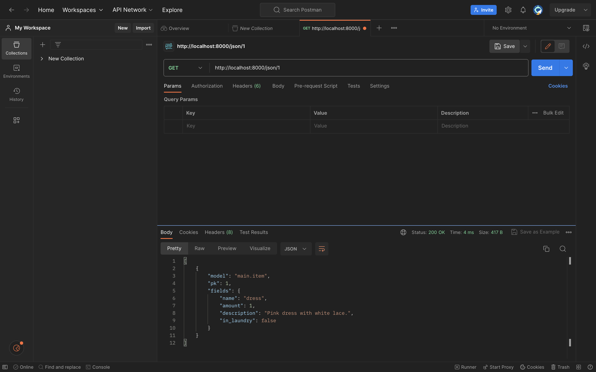
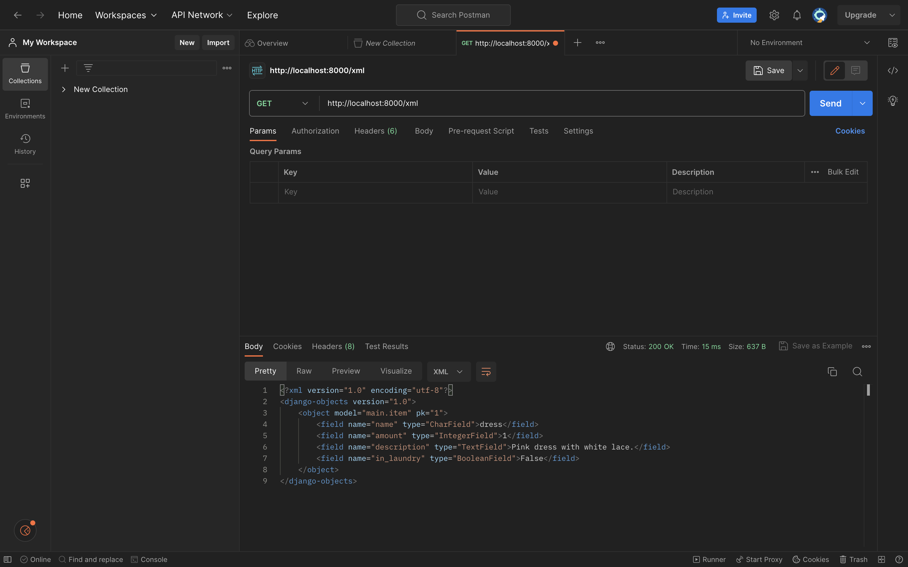
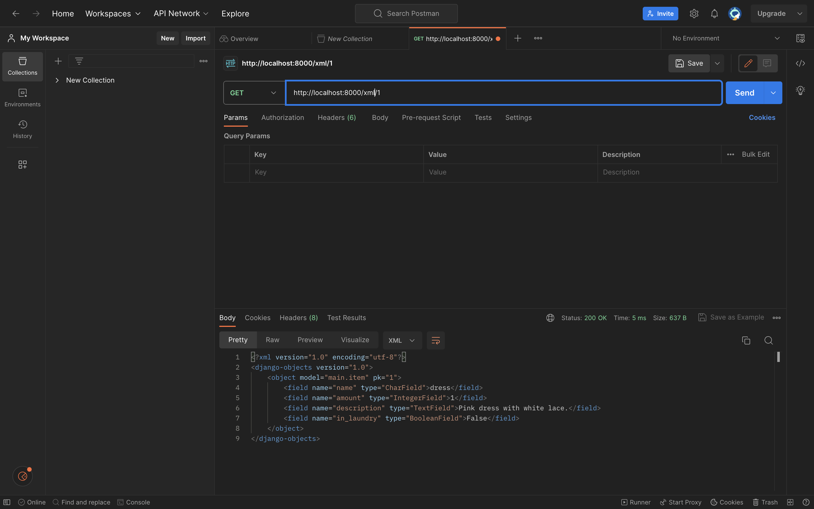
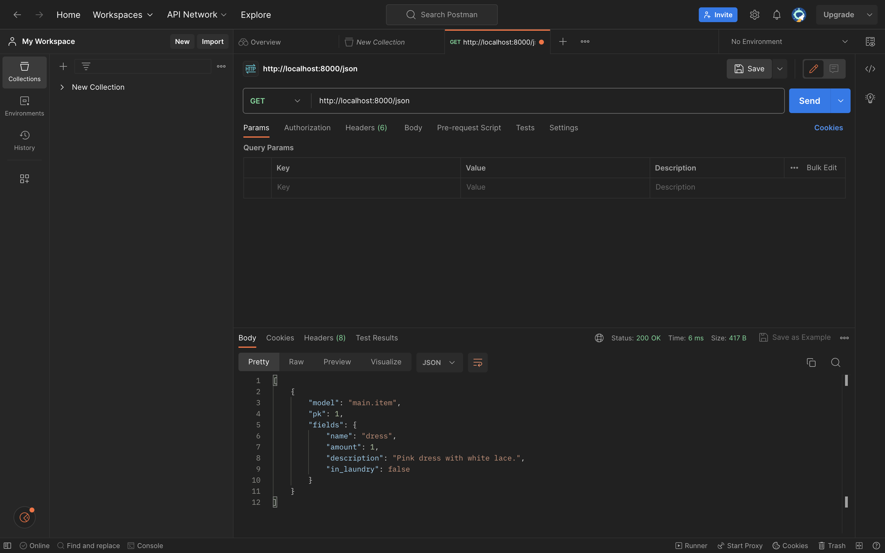

# Tugas 2 :v:

:sparkles: Nama: Kilau Nisrina Akhyaari 

:label: NPM: 2206082051

:dvd: Kelas: PBP E

:iphone: Nama Aplikasi: :coat::jeans: [My Wardrobe](https://mywardrobe.adaptable.app/main/) :dress::scarf:


## 1.  Jelaskan bagaimana cara kamu mengimplementasikan checklist di atas secara step-by-step :card_index_dividers:
### **- Membuat sebuah proyek Django baru.** 
Pertama, untuk membuat proyek Django baru, saya membuat repositori lokal bernama MyWardrobe di laptop saya. Lalu, saya membuat _virtual environment_ pada direktori tersebut untuk mengatur _package_ dan _dependancies_. Kemudian, saya memasang _dependencies_ yang diperlukan dalam requirements.txt dalam _virtual environment_. Lalu, saya membuat proyek Django dengan cara memasukkan ` django-admin startproject MyWardrobe . ` pada terminal. Terakhir, saya mengkonfigurasi dan mengaktifkan server.

### **- Membuat aplikasi dengan nama main pada proyek tersebut.**
Untuk membuat aplikasi main, saya memasukkan perintah ` python manage.py startapp main ` ke terminal. Lalu, saya menambahkan `main` ke settings agar terdaftar ke proyek.

### **- Melakukan routing pada proyek agar dapat menjalankan aplikasi main.**
Untuk mengakses aplikasi main melalui web, perlu dilakukan routing URL. Saya mengatur file urls.py yang berada di direktori proyek agar terhubung. Dalam kata lain, mengarahkan url-url yang secara umum terkait dengan seluruh proyek, bukan hanya satu aplikasi. Step ini penting untuk menghubungkan file urls pada aplikasi dan memungkinkan proyek modular dan terpisah antaraplikasi.

### **- Membuat model pada aplikasi main dengan nama Item dan memiliki atribut wajib name, amount, description.**
Pada file models.py saya membuat class Item yang berisi `name` bertipe **CharField**, `amount` bertipe **IntegerField**, `description` bertipe **TextField**, dan  `in_laundry` bertipe **BooleanField**. Lalu, saya migrasi modelnya untuk memastikan bahwa skema basis data tetap sejalan dengan definisi model-model aplikasi pada proyek dan membantu menjaga konsistensi data dalam aplikasi.

### **- Membuat sebuah fungsi pada views.py untuk dikembalikan ke dalam sebuah template HTML yang menampilkan nama aplikasi serta nama dan kelas kamu.**
Saya menghubungkan view dengan template dengan cara mengintegrasikan komponen MVT. Pada file `views.py` di main saya membuat fungsi `show_main` dan menambahkan context app, name, dan class untuk dipakai dalam template.
Lalu, karena sudah ada context yang berisi dictionary data yang diperlukan, saya mengubah file main.html saya untuk menggunakan variabel yang telah didefinisikan. 

### **- Membuat sebuah routing pada urls.py aplikasi main untuk memetakan fungsi yang telah dibuat pada views.py.**
Saya membuat file urls.py dalam direktori main yang berisi komponen penting dalam pengaturan aplikasi Django. Saya mendefinisikan app_name menjadi `main` dan urlpatterns agar mengarah ke path `show_main`. Step ini memungkinkan URL proyek terarah ke tampilan yang sesuai dengan fitur-fitur di dalam aplikasi.

### **- Melakukan deployment ke Adaptable terhadap aplikasi yang sudah dibuat sehingga nantinya dapat diakses oleh teman-temanmu melalui Internet.**
Saya membuat app baru di Adaptable dengan menghubungkannya ke repositori GitHub My-Wardrobe. Saya memilih Python Template App dan PostgreSQL untuk template dan tipe basis data. Lalu, saya memastikan versi python sudah sesuai dengan yang ada di aplikasi dan di bagian start command saya memasukkan `python manage.py migrate && gunicorn MyWardrobe.wsgi` ntuk memastikan bahwa struktur basis data sesuai dengan definisi model-model aplikasi. Lalu saya mendeploy aplikasi saya agar aktif dan bisa diaskes di internet.


## 2.  Alur Permintaan dan Respon dalam Aplikasi :arrows_counterclockwise:
  
_Request_

   ↓
   
_URLs_

   ↓ 
   
_Views_ ↔ _Models_ ↔ _Database_

   ↓
   
_Template_

   ↓
   
_Response_

   ↓
   
_Client_



   **Penjelasan:** :memo:
   
   Permintaan HTTP dari klien/user pertama-tama akan mencapai file urls.py. File urls.py mengandung pengaturan untuk mengarahkan URL ke tampilan (views) yang sesuai. Pada tahap ini, Django mencocokkan URL yang diterima dari permintaan dengan pola URL yang telah didefinisikan dalam file urls.py.

   Setelah URL cocok dengan pola yang ada dalam berkas urls.py, permintaan akan diteruskan ke tampilan yang sesuai dalam berkas views.py.

   Lalu, jika diperlukan akses ke model-model yang didefinisikan dalam berkas models.py aplikasi. Jika tampilan membutuhkan data dari basis data, mereka akan memanggil query ke model-model ini.

   Ketika views melakukan query ke model-model ini, Django akan menghasilkan SQL yang sesuai dan mengirimkannya ke database. Database akan mengembalikan hasil dari query tersebut ke Django, yang kemudian akan membentuknya menjadi objek Python yang dapat digunakan dalam views.

   Setelah tampilan selesai memproses permintaan dan mendapatkan data yang dibutuhkan, selanjutnya views akan dirender menggunakan template HTML.

   Hasil proses yang disiapkan dalam template HTML akan dikirimkan sebagai respons HTTP kepada klien (pengguna). Respons ini berisi HTML yang akan ditampilkan di browser pengguna, bersama dengan semua elemen seperti gambar, teks, dan data lain yang telah diproses.

   Akhirnya, respons yang dihasilkan akan diterima oleh klien (pengguna), yang akan melihat dan berinteraksi dengan halaman web yang dihasilkan.
   
   
## 3.  Mengapa kita menggunakan virtual environment? :computer:
Menggunakan virtual environment adalah _best practice_ yang sangat disarankan dalam pengembangan aplikasi web berbasis Django dan pengembangan perangkat lunak Python pada umumnya. _Virtual environment_ dibuat di atas instalasi Python yang sudah ada, yang dikenal sebagai _virtual environment's base Python_, dan secara opsional dapat diisolasi dari paket-paket di lingkungan dasar, sehingga hanya paket-paket yang diinstal secara eksplisit di lingkungan virtual yang tersedia. 
    _Virtual environment_ seperti kamar pribadi di rumah. Kita bisa melakukan apa saja seperti membuat proyek, menginstal paket lama dari paket yang sudah ada, dan sebagainya. Aktivitas apa pun tidak akan memengaruhi atau mengganggu file atau proyek lain di komputer.

**Apakah kita tetap dapat membuat aplikasi web berbasis Django tanpa menggunakan virtual environment?**
    Kita bisa membuat aplikasi web berbasis Django tanpa menggunakan virtual environment. Namun, sangat dianjurkan menggunakan virtual environment untuk menjaga kebersihan, isolasi, dan manajemen dependensi yang lebih baik dalam pengembangan proyek. Dengan virtual environment, kita bisa memastikan bahwa proyek memiliki lingkungan yang independen dan terisolasi dari proyek-proyek lain.


## 4.  Jelaskan apakah itu MVC, MVT, MVVM dan perbedaan dari ketiganya. :floppy_disk:
1. **MVC** atau **Model View Controller** adalah pola arsitektur dalam membuat sebuah aplikasi dengan cara memisahkan kode menjadi tiga bagian yang terdiri dari:
        - _Model_: Kode dalam model biasanya mencerminkan hal-hal di dunia nyata. Kode ini dapat menyimpan draw data, atau akan menentukan komponen penting aplikasi.
        - _View_: Kode view berisi semua fungsi yang berinteraksi langsung dengan user atau user interface. Ini adalah kode yang membuat aplikasi terlihat bagus, dan menentukan cara user melihat dan berinteraksi dengannya.
        - _Controller_: Kode controller berperan sebagai penghubung antara model dan view, menerima masukan user dan memutuskan apa yang harus dilakukan dengannya. Ini adalah otak dari aplikasi, dan menyatukan model dan view.

2. **MVT** atau **Model View Template** adalah turunan dari MVC. Namun, controller diatur framework itu sendiri. 
        - _Model_: Berperan sebagai interface untuk data. Merupakan struktur logis di balik seluruh aplikasi web yang diwakili oleh database seperti MySql, PostgreSQL. 
        - _View_: Menjalankan logika bisnis dan berinteraksi dengan Model serta merender template. View menerima permintaan HTTP dan kemudian mengembalikan respons HTTP.
        - _Template_: Template bertindak sebagai lapisan presentasi dan pada dasarnya adalah kode HTML yang merender data. Konten dalam file-file ini dapat bersifat statis atau dinamis.

**MVVM** atau **Model View ViewModel** adalah pola arsitektur yang mengatasi semua kelemahan pola desain MVP dan MVC. MVVM menyarankan untuk memisahkan logika presentasi data (View atau user interface) dari bagian logika bisnis inti aplikasi.
        - _Model_: Mengatur abstraksi sumber data. Model dan ViewModel bekerja sama untuk mendapatkan dan menyimpan data.
        - _View_: Menginformasikan ViewModel tentang tindakan user. Lapisan ini mengamati ViewModel dan tidak mengandung logika aplikasi apa pun.
        - _ViewModel_: Ini memperlihatkan aliran data yang relevan dengan View. Selain itu, ViewModel berfungsi sebagai penghubung antara Model dan View.
        
**Perbedaan utama dari ketiganya adalah dari hubungan komponen-komponennya;**

* Dalam MVC, View dan Model sangat erat kaitannya. Controller dan View mempunyai hubungan satu ke banyak. Satu controller dapat memilih View berbeda berdasarkan operasi yang diperlukan. 
* Dalam MVT, bagian pengontrol dikelola oleh framework itu sendiri. Sehingga, hubungan antarkomponen longgar dan mudah untuk membuat modifikasi. 
* Dalam MVVM, pola arsitektur ini lebih event-driven karena menggunakan data binding sehingga memudahkan pemisahan logika bisnis inti dengan View. Beberapa View dapat dipetakan dengan satu ViewModel, hubungan satu-ke-banyak terjadi antara View dan ViewModel.

**Lalu, bagian-bagian yang bertindak sebagai pengontrol berbeda-beda komunikasinya;**

- MVC mempunyai controller yang mengatur model dan view, lalu view yang menjalankan bagaimana data user akan ditampilkan, namun, view tidak mempunyai pengetahuan tentang controller. 
- MVT mempunyai view untuk menerima request HTTP dan mengembalikan respons HTTP, template yang mengatur bagaimana data user akan ditampilkan. 
- Pada MVVM, View mempunyai referensi ke ViewModel, View berperan mengambil user input dan bertindak sebagai titik masuk aplikasi.

**Penggunaan dan unit testing ketiga pola arsitektur juga berbeda;**

+ MVC cocok untuk proyek skala kecil saja dan memiliki support yang terbatas untuk unit testing.
+ MVT cocok untuk proyek dengan berbagai tingkat kompleksitas. Django menggunakan pola MVT.
+ MVVM cocok untuk proyek berskala besar. Biasanya digunakan untuk aplikasi berbasis User Interface, terutama aplikasi seluler dan desktop yang memiliki tampilan yang kompleks. Ketersediaan unit testing tertinggi untuk pola arsitektur ini. 

Setiap pola arsitektur memiliki tujuan yang sama, yaitu memisahkan komponen-komponen utama dalam pengembangan perangkat lunak untuk membuat kode lebih terstruktur, mudah dipelihara, dan memungkinkan perubahan tanpa mengganggu bagian lain dari aplikasi.

:full_moon_with_face:


# Tugas :three:


## 1. Membuat input form untuk menambahkan objek model pada app sebelumnya. 
Untuk membuat form, agar aplikasi saya bisa digunakan untuk menginput Item berikut adalah step-stepnya:
* Membuat file `forms.py` di direktori main
Isi file tersebut adalah import ModelForm dari django.forms dan import Product dari main.models.
Lalu, saya membuat class ProductForm yang menerima parameter ModelForm, di dalamnya terdapat class Meta dengan `fields = "name", "amount", "description", dan "in laundry"`.
* Menambahkan import di file `views.py` yang berada di folder main.
Saya menambahkan import HttpResponseRedirect, ProductForm, dan reverse.
* Membuat fungsi `create_product` di dalam file `views.py` tersebut.
  Fungsi ini bertujuan agar bisa membuat formulir yang dapat menambahkan data produk ke dalam database secara otomatis ketika pengguna mengirimkan data melalui formulir.
* Mengubah fungsi `show_main` untuk mengambil semua object Product yang ada di database
  Caranya dengan menambahkan `'products': products` di dalam variable `context`.
* Mengimport fungsi `create_product` ke file `urls.py` di dalam folder main.
  Saya menambahkan import `create_product` dari `main.views`.
* Menambahkan path url yang sesuai
  Saya membuat path baru
  ```python
  path('create-product', create_product, name='create_product'),
  ```
* Membuat file HTML baru bernama `create_product.html` pada direktori main dalam folder templates.
  Saya membuat tabel untuk menunjukkan data yang tersimpan di database.
* Menambahkan kode di file `main.html` untuk menampilkan data product yang telah di input
  Untuk melakukan hal tersebut, saya menambahkan kode:
  ```html
  <table>
    <tr>
        <th>Name</th>
        <th>Price</th>
        <th>Description</th>
        <th>Date Added</th>
    </tr>

    
        <tr>
            <td>{{product.name}}</td>
            <td>{{product.price}}</td>
            <td>{{product.description}}</td>
            <td>{{product.date_added}}</td>
        </tr>
    
  </table>
  ```
Lalu, saya membuaat button untuk menambahkan product dan diarahkan ke url create_product.
```html
<a href="">
    <button>
        Add New Product
    </button>
</a>
```

## 2. Menambahkan fungsi `views` untuk melihat objek yang sudah ditambahkan dalam format HTML, XML, JSON, XML by ID, dan JSON by ID.
Saya menambahkan kode berikut dalam file `views.py` yang berada di main.
```python
def show_main(request):
    items = Product.objects.all()

    context = {
        'items': items
    }

    return render(request, "main.html", context)

def show_xml(request):
    data = Product.objects.all()
    return HttpResponse(serializers.serialize("xml", data), content_type="application/xml")

def show_json(request):
    data = Product.objects.all()
    return HttpResponse(serializers.serialize("json", data), content_type="application/json")

def show_xml_by_id(request, id):
    data = Product.objects.filter(pk=id)
    return HttpResponse(serializers.serialize("xml", data), content_type="application/xml")

def show_json_by_id(request, id):
    data = Product.objects.filter(pk=id)
    return HttpResponse(serializers.serialize("json", data), content_type="application/json")
```
Dengan lima fungsi views ini, kita dapat melihat objek yang sudah ditambahkan dalam format HTML, XML, JSON, XML by ID, dan JSON by ID di aplikasi Django `MyWardrobe`.

## 3. Membuat routing URL untuk masing-masing views yang telah ditambahkan pada poin 2.
Routing URL memungkinkan aplikasi untuk menghubungkan URL tertentu dengan view yang sesuai. Ketika user mengakses URL tertentu, Django akan menggunakan routing URL untuk menentukan view yang harus dipanggil.
Pada file `urls.py` pada direktori main, saya menambahkan kode berikut:
```python
urlpatterns = [
    path('', show_main, name='show_main'),
    path('xml/', show_xml, name='show_xml'), 
    path('json/', show_json, name='show_json'),
    path('xml/<int:id>/', show_xml_by_id, name='show_xml_by_id'),
    path('json/<int:id>/', show_json_by_id, name='show_json_by_id'),
]
```

## Pertanyaan :grey_question:
### 1. Apa perbedaan antara form POST dan form GET dalam Django?
**GET** biasanya digunakan untuk operasi yang aman dan _read-only_ di mana data dapat terlihat di URL dan dibagikan dengan mudah. GET menggabungkan data yang dikirimkan ke dalam string, lalu menggunakannya untuk membuat URL yang berisi alamat tujuan pengiriman data, serta _key_ dan _value_ data.
**POST** digunakan untuk operasi yang mengubah status server atau melibatkan data sensitif dan di mana data tidak boleh diekspos di URL. POST memiliki perlindungan CSRF Django yang memungkinkan kontrol lebih terhadap akses.

Post cocok digunakan untuk login form, karena biasanya untuk login perlu password. Password adalah hal yang sensitif, sehingga seharusnya tidak ditampilkan dalam url.
Sedangkan GET cocok untuk _web search form_, karena URL yang terkait dengan permintaan GET dapat dengan mudah di-_bookmark_, di-_share_, atau digunakan kembali.

### 2. Apa perbedaan utama antara XML, JSON, dan HTML dalam konteks pengiriman data?

* **HTML (HyperText Markup Language)**
**HTML** adalah dasar pengembangan web dan digunakan untuk menentukan struktur halaman. HTML digunakan untuk menjelaskan bagaimana data ditampilkan. HTML digunakan browser web untuk menafsirkan dan menyusun teks, gambar, dan materi lainnya ke dalam halaman web yang _visible_ atau _audible_.

* **JSON (JavaScript Object Notation)**
**JSON** digunakan untuk menyimpan dan mengirimkan data. JSON adalah cara untuk merepresentasikan objek. JSON adalah format pertukaran data yang berbasis teks dan terdiri dari pasangan _key-value_. File JSON lebih mudah dibaca daripada XML, karena lebih ringkas. 

* **XML (eXtensible Markup Language)**
**XML** digunakan untuk merepresentasikan data dengan cara yang dapat dibaca mesin. XML adalah bahasa markup yang fleksibel dan memungkinkan definisi struktur data yang kompleks. XML menggunakan struktur _tag_ untuk mewakili item data.

### 3. Mengapa JSON sering digunakan dalam pertukaran data antara aplikasi web modern?
JSON umumnya digunakan untuk _serialization_ dan mengirimkan data melalui koneksi jaringan seperti internet. Penggunaan JSON terutama untuk mengirimkan data antara server dan aplikasi web. JSON mendapatkan momentum dalam _API code programming_ dan layanan web karena membantu pertukaran data dan hasil layanan web yang cepat. JSON berbasis teks, ringan, dan memiliki format data yang _easy to parse_ sehingga tidak memerlukan kode tambahan untuk _parsing_/penguraian.

## POSTMAN :postbox:
**Postman Screenshot for HTML (main)**


**Postman Screenshot for XML**


**Postman Screenshot for XML by ID**


**Postman Screenshot for JSON**


**Postman Screenshot for JSON by ID**


:new_moon_with_face:


# Tugas :four:

## 1. Mengimplementasikan fungsi registrasi, login, dan logout untuk memungkinkan pengguna untuk mengakses aplikasi sebelumnya dengan lancar.
Fungsi `registrasi` memungkinkan user baru untuk membuat akun di aplikasi. Fungsi `login` memungkinkan user yang telah terdaftar untuk masuk ke dalam akun mereka. Fungsi `logout` memungkinkan pengguna untuk keluar dari akun mereka dan mengakhiri sesi mereka.

Pertama, pada file `views.py` dalam direktori `main` saya mengimport redirect, UserCreationForm, messages, authenticate, login, dan logout. 
`redirect`: Mengarahkan pengguna ke halaman lain dalam aplikasi web.
`UserCreationFor`m: Formulir bawaan Django untuk membuat akun pengguna.
`messages`: Modul untuk menampilkan pesan kepada pengguna dalam aplikasi web.
`authenticate`: Fungsi untuk mengotentikasi pengguna dalam Django.
`login`: Fungsi untuk masukkan pengguna dalam Django.
`logout`: Fungsi untuk keluarkan pengguna dari sesi dalam Django.

Lalu, saya menambahkan beberapa fungsi di dalam file `views.py` dalam direktori `main`, yaitu: 
```
def register(request):
    form = UserCreationForm()

    if request.method == "POST":
        form = UserCreationForm(request.POST)
        if form.is_valid():
            form.save()
            messages.success(request, 'Your account has been successfully created!')
            return redirect('main:login')
    context = {'form':form}
    return render(request, 'register.html', context)

def login_user(request):
    if request.method == 'POST':
        username = request.POST.get('username')
        password = request.POST.get('password')
        user = authenticate(request, username=username, password=password)
        if user is not None:
            login(request, user)
            response = HttpResponseRedirect(reverse("main:show_main")) 
            response.set_cookie('last_login', str(datetime.datetime.now()))
            return response
        else:
            messages.info(request, 'Sorry, incorrect username or password. Please try again.')
    context = {}
    return render(request, 'login.html', context)

def logout_user(request):
    logout(request)
    response = HttpResponseRedirect(reverse('main:login'))
    response.delete_cookie('last_login')
    return response
```

Setelah itu, di direktori `main` > `templates` saya membuat file html baru bernama `register.html` yang berisi form registrasi yang akan mengambil input dari user, mengirimkannya melalui metode POST, dan juga menampilkan pesan-pesan kepada user. Saya juga menghias page tersebut dengan menambahkan `style` di file html tersebut. 

Saya juga membuat file `login.html` dalam direktori `main` > `templates`. File ini berfungsi sebagai halaman login dalam sebuah aplikasi web. Halaman ini memuat  form login yang mengambil input username dan password dari user. Ketika formulir ini di-_submit_, data akan dikirimkan dengan metode POST. Halaman juga menampilkan pesan-pesan kepada user jika terdapat pesan-pesan yang perlu ditampilkan, seperti pesan kesalahan saat login gagal. Terakhir, halaman ini menyertakan tautan untuk menuju halaman registrasi jika user belum memiliki akun, dengan menggunakan tautan yang mengarah ke URL untuk halaman register.

Untuk logout, saya hanya menambahkan button `logout` pada `main.html`. Saya juga membuat halaman main terbatas penggunaannya dengan menambahkan `login_required` pada file `views.py` di direktori `main`.

Di file `urls.py` saya menambahkan import `register`, `login_user`, dan `logout_user`.
Saya juga menambahkan path-path yang sesuai pada urlpatterns;
```
path('register/', register, name='register'), 
path('login/', login_user, name='login'),
path('logout/', logout_user, name='logout'),
```

## 2. Membuat dua akun pengguna dengan masing-masing tiga dummy data menggunakan model yang telah dibuat pada aplikasi sebelumnya untuk setiap akun di lokal.
Untuk bagian ini, saya melakukan registrasi 2 kali dengan nama akun yang berbeda. Lalu, saya login dan menambahkan 3 _clothing item_ di aplikasi saya. Saya lalukan hal yang sama untuk akun kedua saya dengan data yang berbeda.

## 3. Menghubungkan model Item dengan User.
Pertama, pada file `models.py` di direktori `main`, saya meng-_import_ `User`. Dengan meng-_import_ `User`, aplikasi saya bisa digunakan untuk membuat, mengelola, dan mengautentikasi akun user. Saya juga menggunakannya sebagai referensi saat menampilkan data milik user.
Lalu, saya menambahkan kode
```
user = models.ForeignKey(User, on_delete=models.CASCADE)
```
untuk menghubungkan objek dalam model saat ini dengan objek dalam model `User` dari Django. Opsi `on_delete=models.CASCADE` menentukan bahwa ketika objek User terkait dihapus, objek dalam model saat ini yang menggunakan _foreign key_ tersebut juga akan dihapus secara otomatis untuk menjaga konsistensi dalam database.

Setelah itu, dalam fungsi `create_product` dalam file `views.py` dalam main, saya memodifikasi fungsinya dengan menyisipkan
```
if form.is_valid() and request.method == "POST":
     product = form.save(commit=False)
     product.user = request.user
     product.save()
     return HttpResponseRedirect(reverse('main:show_main'))
```
untuk memproses data dari form, menghubungkannya dengan user yang login saat ini, menyimpannya ke dalam database, dan mengarahkan user ke halaman main setelah berhasil tersimpan.
Dalam fungsi `show_main` saya mengubah _value_ context nama menjadi `request.user.username` untuk menyesuaikan user yang login. Tidak lupa, saya menambahkan `items = Item.objects.filter(user=request.user)` untuk hanya menampilkan data dari user spesifik yang sedang login.

Terakhir, saya melakukan migrasi untuk menyimpan perubahan data.

## 4. Menampilkan detail informasi pengguna yang sedang logged in seperti username dan menerapkan cookies seperti last login pada halaman utama aplikasi.
Pada file `models.py`, saya membuat relasi antara item dengan _foreign key_. Caranya dengan menambahkan kode
```python
user = models.ForeignKey(User, on_delete=models.CASCADE)
```
_ForeignKey_ digunakan untuk menyambungkan suatu objek dengan objek lain, dalam konteks ini menghubungkan setiap item dengan user yang membuatnya.

Untuk menampilkan siapa yang sedang login dalam aplikasi, saya memodifikasi fungsi `show_main` dengan cara mengubah _value_ context nama menjadi `request.user.username` untuk menyesuaikan user yang login.

Untuk menampilkan data _last login_ pada aplikasi, pertama-tama saya mengimport `datetime` di file `views.py` dalam `main`. 
Lalu, saya memodifikasi kode saya bagian `login_user` menjadi
```python
if user is not None:
    login(request, user)
    response = HttpResponseRedirect(reverse("main:show_main")) 
    response.set_cookie('last_login', str(datetime.datetime.now()))
    return response
```
Bagian ini untuk memproses login user dalam aplikasi web yang melibatkan otentikasi, pengaturan sesi, mengirim cookie, dan mengarahkan user ke halaman yang sesuai.
Lalu, tidak lupa saya menambahkan `context` pada fungsi `show_main` dengan menambahkan 
```python
'last_login': request.COOKIES['last_login'],
```
Lalu, di bagian fungsi `logout_user` saya menambahkan baris kode
```python
response = HttpResponseRedirect(reverse('main:login'))
response.delete_cookie('last_login')
```
untuk menghapus data cookie pengguna yang baru saja logout.

Pada file `main.html` saya menggunakan context `last_login` dengan cara
```html
<h5>Last entered MyWardrobe: {{ last_login }}</h5>
```
untuk memberikan informasi user yang sedang login.

## Pertanyaan :grey_question: 
### 1. Apa itu Django UserCreationForm, dan jelaskan apa kelebihan dan kekurangannya?
**Django UserCreationForm** adalah kelas `form` bawaan yang disediakan oleh _user authentication system_ Django. Kelas ini digunakan untuk memfasilitasi pembuatan akun user baru dalam aplikasi Django. Form ini turunan kelas ModelForm, yang memungkinkan pengembang pembuatan formulir untuk registrasi user. **UserCreationForm** menyederhanakan proses pengumpulan dan validasi data pendaftaran user seperti nama user dan password. Sehingga, membuatnya lebih mudah untuk menerapkan fungsi registrasi user dalam proyek Django.

Kelebihan **UserCreationForm** adalah aspek _security_ dan _reliability_. Django memiliki _middleware_ pengelolaan kata sandi yang substansial dengan model `User`. Sistem password defaultnya saja sudah memberikan keamanan yang kuat tanpa upaya apa pun dari __developer__. 
Kelebihan lainnya adalah fitur yang mengharuskan _username_ yang dibuat user unik. Syarat keunikan ini diproses pada tingkat database, tetapi diverifikasi ulang oleh form yang disediakan Django.
Kekurangan kelas ini adalah tidak mudah untuk memodifikasi data fields seperti menghapus atau menambahkan data. _Framework UserCreationForm_ juga tidak mendukung perubahan. Model User generik dibuat di database aplikasi secara default selama pembuatan proyek Django baru. Ada banyak hal yang terikat dengan model user default sehingga mengubahnya dapat menimbulkan efek yang tidak terduga pada aplikasi, terutama jika menggunakan _thir party libraries_.

### 2. Apa perbedaan antara autentikasi dan otorisasi dalam konteks Django, dan mengapa keduanya penting?
* Autentikasi memverifikasi bahwa si user adalah siapa yang diklaim sebagai "user", dan otorisasi menentukan apa yang bisa diakses oleh user yang diautentikasi.
* Dalam autentikasi, user di-_verifikasi_. Sedangkan proses autorisasi mem-_validasi_ user.
* Proses yang pertama dilakukan adalah autentikasi, lalu autorisasi.
* Autentikasi user biasanya mengidentifikasi nama, password, dan biometrik. Otorisasi user dilakukan melalui pemberian hak akses sesuai dengan peran/tingkatan user.

Secara keseluruhan, **Autentikasi** dan **Otorisasi** digunakan dalam untuk keamanan data agar memungkinkan perlindungan sistem data secara otomatis. Oleh karena itu, keduanya sangat penting, terutama di era _big data_ ini.


### 3. Apa itu cookies dalam konteks aplikasi web, dan bagaimana Django menggunakan cookies untuk mengelola data sesi pengguna?
**Cookies** adalah _text file_ dengan potongan data seperti nama user dan password. _Cookie_ digunakan untuk membantu komputer mengidentifikasi user. Data yang disimpan dalam cookie dibuat oleh server pada koneksi user. Data ini diberi label dengan ID yang unik untuk user dan komputer user. Ketika terjadi pertukaran _cookie_ antara komputer user dan server jaringan, server membaca ID dan mengetahui informasi apa yang khusus disajikan untuk si user. _Cookie_ membantu _developer_ memberi user pengalaman yang dipersonalisasi. Cookie memungkinkan situs web mengingat user serta data-data user seperti isi keranjang belanja, halaman yang disimpan, dan lainnya.

Django menggunakan _cookie_ yang berisi id sesi unik untuk mengidentifikasi setiap browser dan sesi terkaitnya. Data sesi disimpan dalam database situs secara default. Framework _session_ di Django memungkinkan user menyimpan dan mengambil data sesuai user situs. Pada _request_ berikutnya, browser mengirimkan _sessionid cookie_ ke server. Django kemudian menggunakan _cookie_ ini untuk mengambil data sesi dan membuatnya dapat diakses di tempat lain.

### 4. Apakah penggunaan cookies aman secara default dalam pengembangan web, atau apakah ada risiko potensial yang harus diwaspadai?
Secara default, _cookie_ tidak berbahaya dalam pengembangan web. Namun, jika data cookie diakses orang yang mempunyai niat jahat seperti _cyberattacker_,mereka bisa mengakses sesi _search_, mencuri informasi pribadi, atau menyalahgunakan data cookie pengguna. 
Suatu website mungkin saja menjual data dari cookie ke pihak ketiga atau bisa saja menggunakannya untuk _hack_ akun user.
Sebaiknya, kita tidak menerima cookie dari situs web yang _unsecure_. Kita juga bisa menolak penggunaan cookie. Sebagian besar website akan berfungsi dengan baik tanpa mengumpulkan informasi pribadi user melalui cookie. 

### Implementasi Bonus
Menambahkan tombol dan fungsi untuk menambahkan amount suatu objek sebanyak satu dan tombol untuk mengurangi jumlah stok suatu objek sebanyak satu dan tombol fungsi untuk menghapus suatu objek dari inventori.

Saya memodifikasi table saya di main.html menjadi 
```html
<table>
        <tr>
            <th>Name</th>
            <th>Amount</th>
            <th>Increase/Decrease</th> 
            <th>Description</th>
            <th>In Laundry?</th>
            <th>Delete</th> 
        </tr>
        
            <tr>
                <td>{{ item.name }}</td>
                <td>{{ item.amount }}</td>
                <td>
                    <!-- Increase and Decrease Buttons -->
                    <a href="">+</a>
                    <a href="">-</a>
                </td>
                <td>{{ item.description }}</td>
                <td>{{ item.in_laundry }}</td>
                <!-- Delete Button -->
                <td><a href="">Delete</a></td>
            </tr>
        
    </table>
``` 

Lalu, saya menambahkan fungsi untuk melakukan increase/decrease amount dan delete item pada `views.py` saya di direktori main. Saya mengimport `get_object_or_404` dari django.shortcuts. 

```python
def increase_amount(request, item_id):
    item = get_object_or_404(Item, pk=item_id, user=request.user)
    item.amount += 1
    item.save()
    return HttpResponseRedirect(reverse('main:show_main'))

def decrease_amount(request, item_id):
    item = get_object_or_404(Item, pk=item_id, user=request.user)
    if item.amount > 0:  
        item.amount -= 1
        item.save()
    return HttpResponseRedirect(reverse('main:show_main'))

def delete_item(request, item_id):
    item = get_object_or_404(Item, pk=item_id, user=request.user)
    item.delete()
    return HttpResponseRedirect(reverse('main:show_main'))
```

Terakhir, saya mengkonfigurasi `urls.py` saya dalam direktori main agar fungsi-fungsi yang sudah saya buat bisa diintegrasikan. Saya mengimport `increase_amount, decrease_amount, delete_item` dari main.views dan menambahkan path-path berikut di dalam urlspatterns.

```python
    path('increase_amount/<int:item_id>/', increase_amount, name='increase_amount'),
    path('decrease_amount/<int:item_id>/', decrease_amount, name='decrease_amount'),
    path('delete_item/<int:item_id>/', delete_item, name='delete_item'),
```
